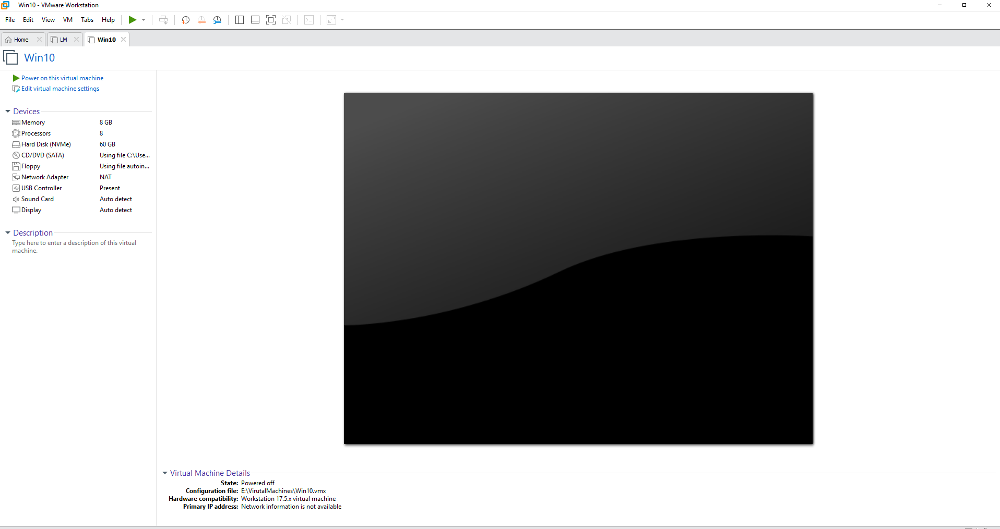
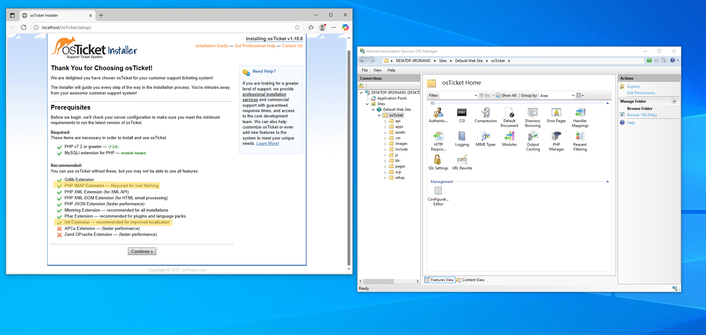

# osTicket
osTicket is a free, open-source, web-based support ticketing system used to manage and organize customer support requests. This project will cover the steps I take to install and configure osTicket.

# Installation
To begin this project I stated by downloading a few necessary tools: osTicket, HeidiSQL, MySQL, PHP, and Microsoft Visual C++. In VMware I created a Windows 10 machine and allocated it 8 gigs of RAM, 4 processors (2 cores), 60 gigs of storage, and I kept my newtowrk adapted set to NAT.

After setting up my Windows 10 virtual machine, I powered it on and proceeded to install the tools that I downloaded earlier and enabled "Internet Information Services (IIS)".

I then reloaded IIS and enabled some PHP extensions (php_imap.dll, php_intl.dll, php_opcache.dll). Afterwards I continued setting up osTicket within my browser by providing my helpdesk with the name "helpdesk" and providing an email that will be used to receive tickets from customers.
